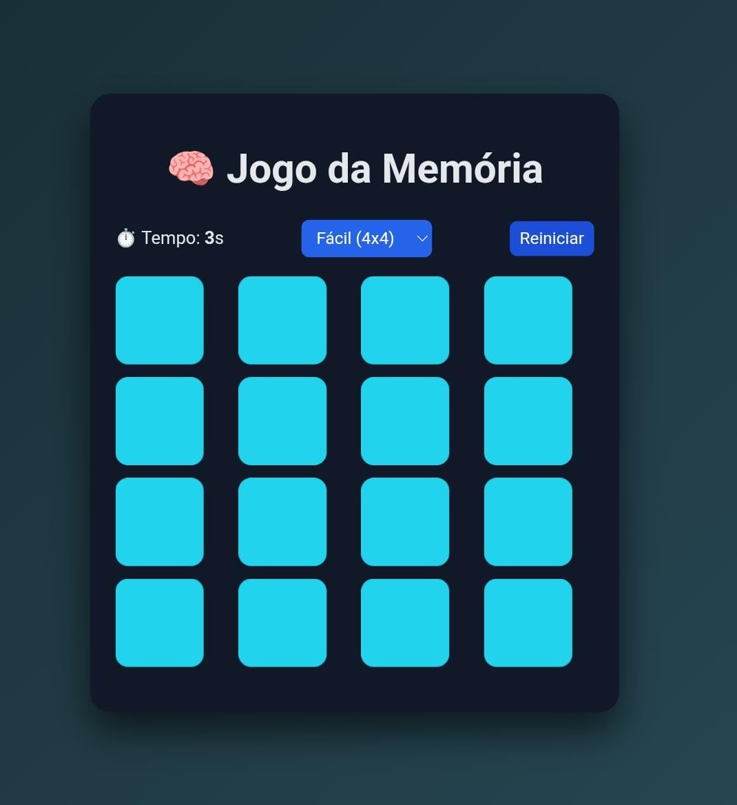

🎮 Demonstração

Adicione aqui uma imagem ou GIF do jogo funcionando.

---

🚀 Funcionalidades

🃏 Sistema de cartas viradas
🧠 Encontrar pares de cartas iguais
📊 Dois níveis de dificuldade
⏱️ Cronômetro durante a partida
🔄 Reiniciar jogo
🎨 Interface simples e intuitiva

---

🎯 Níveis do Jogo
Nível	Tamanho do Tabuleiro
Fácil	4x4
Difícil	6x6

Cada nível altera a quantidade de cartas e aumenta o desafio do jogo.

---

🛠️ Tecnologias Utilizadas

HTML5 → Estrutura do jogo

CSS3 → Layout e animações

JavaScript → Lógica do jogo e cronômetro

📂 Estrutura do Projeto
jogo-da-memoria/
│
├── index.html
├── style.css
├── script.js
└── README.md

---

⚙️ Como Executar o Projeto

1️⃣ Clone o repositório

git clone https://github.com/cassymari/jogo-da-memoria.git

2️⃣ Acesse a pasta

cd jogo-da-memoria

3️⃣ Abra o arquivo index.html no navegador.

---

🎯 Objetivo do Projeto

Este projeto foi desenvolvido para:

Praticar lógica de programação

Trabalhar com manipulação do DOM

Criar interatividade com JavaScript

Desenvolver um projeto para portfólio no GitHub

---

🔮 Melhorias Futuras

🏆 Sistema de pontuação

💾 Salvar melhor tempo

📱 Versão responsiva para celular

🔊 Efeitos sonoros

🎨 Novos temas de cartas

---

👨‍💻 Autor

Desenvolvido por Cassiane M. Nascimento

🔗 GitHub
https://github.com/cassymari

⭐ Se você gostou do projeto, considere dar uma estrela no repositório.
